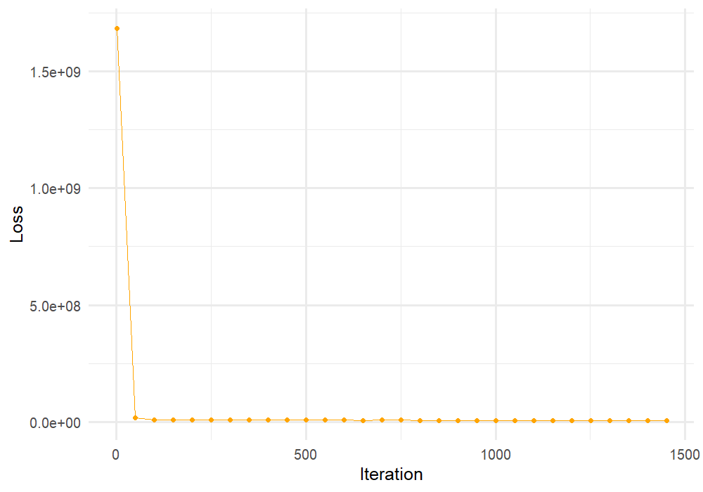

# InterpretableWordEmbeddings

This repository implements models described in *''Interpretale Word Embeddings via Informative Priors''* (Hurtado Bodell, Arvidsson and Magnusson 2019). Below, an example of how to use the code is described.  

<!--
## Example
For illustrative purposes, this page provides an instructive example of how can use the code. -->

### Prerequisites

The code is implemented in R, and uses Tensorflow/Tensorflow Probability. In case you have yet to install them, here's one way of doing so:

```
# Tensorflow
devtools::install_github("rstudio/tensorflow")
library(tensorflow)
install_tensorflow()

# Tensorflow Probability
install_tensorflow(
  extra_packages = c("keras", "tensorflow-hub", "tensorflow-probability")
)
```

### Cloning repo and loading functions

To use the code, clone the repo, and load all the functions from the repository:

```
source('.../src/data.R')
source('.../src/init.R')
source('.../src/utils.R')
source('.../src/model.R')
```

### Toy example

To illustrate how to use the code, we consider one of the priors described in the paper, and apply it to the freely available Gutenberg data (https://www.gutenberg.org/).

#### (1) Downloading, cleaning and preprocesessing

As a first step, we (1.1) download the Gutenberg data using the R package ```gutenbergr```, (1.2) apply some rudimentary cleaning (e.g. remove non-alphanumeric characters, make it lower-case) and (1.3) prepare text for word embedding estimation (e.g. create vocabulary statistics & assign weighted negative-sampling probabilities)

```
# (1.1) Download
gutenberg_sample <- dl_gutenberg_sample(n = 20, category='Bestsellers, American, 1895-1923')
# (1.2) Basic cleaning
gutenberg_sample <- basic_cleaning(gutenberg_sample)
# (1.3) Prepare data for word embeddings
d <- process_text_string(text_string = gutenberg_sample, vocab_size = 10000L)
```
The result is one long text string.

#### (2) Define priors

Second, we select *prior specification*, and *which words* that we want to use as *anchored word types*. [Note: throughout, you'll see ```args``` appearing in the code. This is a list object storing all hyperparameters. They are set in the ```init.R``` file]

**Prior specifications**:

* 1 = Strict Standard Basis
* 2 = Weak Standard Basis
* 3 = 2 + Neutral words
* 4 = Truncated Normal

```
# Prior specification
args$prior_type <- 3

# Example: Gender
pos = c('he', 'son', 'his', 'him', 'father',  'boy', 'himself', 'male', 'brother', 'men', 'uncl', 'nephew')
neg = c('she', 'daughter','femen','her', 'mother', 'girl', 'herself', 'femal', 'sister', 'women','aunt', 'niec')    
neutral <- c('the','it', 'a','an','and','as','of','at','by')

# Construct list storing information about prior
args$prior_list <- list('prior_type' = prior_type,            
                        'categ1' = pos,                       # Positive priors word types
                        'categ2' = neg,                       # Negative prior word types
                        'categ3' = neutral,                   # Neutral word types
                        'vectors' = c('rho','alpha'))         # On which vectors to place informative priors: rho, alpha         

```

#### (3) Reorder matrix

As a final step before estimation, we reorder the word embedding matrix such that anchor word types occupy the first rows of the matrix. This simplifies the instantiation of priors significantly.

```
objs <- reset_d_based_on_anchored_priors(args = args, 
                                         d = d, 
                                         prior_type = args$prior_type)
d <- objs$d ; args <- objs$args ; rm(objs)
```


<!--
To show how the method can be used, we now consider one of the prior specifications described in the paper.
In this example, we will use Gutenberg data. Please visit XXX and download YYY. Having downloaded the files, run the following code to pre-process the data in accordance with (Hurtado Bodell, Arvidsson and Magnusson 2019): -->


#### (4) Estimation

Estimation is performed by calling the ```anchored_embedding()``` function.

```
output <- anchored_embedding(args = args, d = d)
```

#### (5) Check convergence

<!--

-->


#### (6) Inspect dimension

<!--

-->


## Acknowledgments

* Our paper and code builds directly on Maja Rudolph's great work on Exponention Family Embeddings (https://github.com/mariru).
